# Chat with Company Docs (RAG-based)

This project enables conversational interaction with company documents using **Retrieval-Augmented Generation (RAG)**. It processes files, updates vector storage, and manages document modifications efficiently.

## 🚀 Features
- **Retrieval-Augmented Generation (RAG)** for answering queries from company docs.
- **Automated file processing** (new, modified, and deleted files).
- **Vector embedding updates** via Pinecone.
- **Error handling** for failed document updates.

## 📜 **Key Flow - Detailed Breakdown**

```mermaid
graph TD
    A[Start Update] --> B{File exists in JSON index?}
    B -->|No| C[Process as a New File]
    B -->|Yes| D{Has File Been Modified?}
    
    D -->|Yes| E[Delete Existing Vector Entries]
    E --> C 
    
    C --> F[Generate File Embeddings]
    F --> G[Store Embeddings in Pinecone]
    G --> H{Embedding Upload Successful?}
    
    H -->|Yes| I[Update JSON Index with File Metadata]
    H -->|No| J[Mark File as Error in JSON]
    
    K[Check for Deleted Files] --> L{File Missing in Source?}
    L -->|Yes| M[Delete Vector Embeddings from Pinecone]
    M --> N[Remove File Entry from JSON Index]
    
    I --> O[Update Complete 🎉]
    J --> O
    N --> O
```



### **Granular Code Execution Steps**

#### **Step 1: Checking the JSON Index**
- The system first checks if the file exists in the **JSON index** (which tracks processed files).
- If it's **not found**, it's treated as **new** and moves to the embedding stage.
- If the file **already exists**, the system checks if it has changed.

#### **Step 2: Handling Modified Files**
- If a file **has been modified**, its **old vector embeddings** are **deleted** from Pinecone.
- It is then **reprocessed** as if it were a new file.

#### **Step 3: Processing New or Modified Files**
- **Embeddings are generated** for the file.
- These **embeddings are sent to Pinecone** for storage.
- If **successful**, the JSON index is updated.
- If **unsuccessful**, the file is marked as an **error** in JSON.

#### **Step 4: Handling Deleted Files**
- The system checks if any **previously processed files** have been **deleted** from the source directory.
- If a file is **missing**, its **vector embeddings** are **removed** from Pinecone.
- The JSON index is updated to **remove the file entry**.

#### **Step 5: Finalizing the Update**
- The system marks the update as **complete** and logs the results.

## 🛠️ Setup

### 1️⃣ Install Dependencies
Ensure you have Python 3.8+ installed, then run:

```sh
pip install -r requirements.txt
```

### 2️⃣ Configure Environment Variables
Create a `.env` file and add:

```
PINECONE_API_KEY=your_pinecone_key
GOOGLE_API_KEY=your_google_key
```

### 3️⃣ Run the System
Start the chat interface with:

```sh
python main.py
```

## 📂 File Structure
- `main.py` - Entry point for the chat system.
- `chat_interface.py` - Handles chat interactions.
- `vector_updater.py` - Manages file embedding and vector updates.
- `requirements.txt` - Dependencies list.

## 🔧 How It Works
1. **New files** are processed and embedded into the vector database.
2. **Modified files** trigger vector deletion and re-embedding.
3. **Deleted files** remove corresponding vectors.
4. The system updates a JSON index tracking processed files.

## 🛠️ Tech Stack
- **LLM APIs:** Google Generative AI / Groq
- **Vector Storage:** Pinecone
- **Auth & API Handling:** Google API, Requests
- **Env Management:** dotenv
- **Logging & Debugging:** Rich